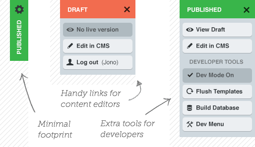

# BetterNavigator for SilverStripe



This module is intended to replicate and expand upon the functionality provided by SilverStripe's built-in SilverStripeNavigator class. It provides a handy front-end menu for CMS users which offers these features:

**For Content Authors**

 * Indicates to a user that they are logged in
 * Indicates whether they are viewing draft or live content
 * Quickly edit the page you're viewing

**For Developers**

 * When in Dev Mode links are included for accessing most of SilverStripe's [URL Variable Tools](http://doc.silverstripe.org/framework/en/reference/urlvariabletools)
 * Developers can access these tools on a live website by nominating themselves as a developer in the site config

## Requirements

SilverStripe 3.1

## Installation

**Composer / Packagist ([best practice](http://doc.silverstripe.org/framework/en/trunk/installation/composer))**
Add "jonom/silverstripe-betternavigator" to your requirements.

**Manually**
Download, place the folder in your project root, rename it to 'betternavigator' (if applicable) and run a dev/build?flush=1.

## How to use

Just place **$BetterNavigator** somewhere in your template(s). If your website uses caching, make sure BetterNavigator's output is excluded.

**Access developer tools on a live website**
You can mark certain CMS users as developers in your site's config, so they can access developer tools when logged in. Example YAML:

```
  BetterNavigator:
    developers:
      - 'dev@yoursite.com'
      - 'otherdev@yoursite.com'
```

## Customisation

BetterNavigator's output is controlled by templates so it can be [easily overridden](http://doc.silverstripe.org/framework/en/topics/theme-development# overriding).

#### Option 1: Add some stuff

If you want to add some content (new buttons for instance) to BetterNavigator, just create a template called *BetterNavigatorExtraContent.ss* or *BetterNavigatorExtraDevTools.ss* and add your content to it. Place the template in the includes folder for your website's theme, or in *mysite/templates/includes/* if you want to use it across multiple themes.

#### Option 2: Complete control

All content, scripts and CSS are loaded via the BetterNavigator.ss template, so you can completely customise BetterNavigator's front-end code by copying or creating your own BetterNavigator.ss template.

The BetterNavigator.ss template's scope is set to the page that is being viewed, so any methods available in your page controller will be available in the BetterNavigator.ss template. This should allow you to add custom links by page type and introduce complex logic if you want to.

## Known issues

 * Probably won't work in IE8 or lower.

## Bonus: better debugging tools

This module provide quick access to SilverStripe's built in [URL Variable Tools](http://doc.silverstripe.org/framework/en/reference/urlvariabletools) but reading their output isn't much fun. You can peek under SilverStripe's hood much more conveniently using the recently released [SilverStripe Clockwork](https://github.com/markguinn/silverstripe-clockwork) by Mark Guinn. Out of the box SQL Queries and controller events are logged. It's Chrome only for now.
